# Member Engagement Data Pipeline (AWS)

A production-style data platform for a **community health worker (CHW)
program** serving health-plan members. The program's customers are health
plans. Each plan sends a roster of its members, CHWs reach out to those
members and log the work in Salesforce, members attend community events, and
each plan gets monthly program KPIs back.

Built on **S3 + IAM + Redshift Serverless**, with **pandas/SQL** pipelines,
**Airflow** orchestration (replacing a legacy cron job), ingestion from
**Salesforce, a REST API and Google Sheets**, and PHI safeguards throughout.
Everything is synthetic, and the infrastructure is sized for a free or
trial AWS account.

## Architecture

```
  Health plans (customers)        Salesforce            Events platform        Google Sheet
  roster CSVs, 2 layouts          CHW activity (Task)   REST, cursor-paged     do-not-contact list
  (SFTP -> S3 in prod)            + free-text notes     nested attendees       (hand-maintained)
          │                              │                      │                     │
          ▼                              ▼                      ▼                     ▼
  ┌─────────────────────────────── S3 data lake (SSE, TLS-only, versioned) ──────────────────┐
  │  raw/<source>/dt=YYYY-MM-DD/   every file and API page, as received (replayable)        │
  │  rejects/<source>/dt=.../      rows that failed validation, with a reason                │
  │  staged/<table>/load_id=.../   Parquet with an explicit Arrow schema                     │
  │  exports/plan_kpis/dt=.../     what was reported to each customer                        │
  └──────────────────────────────────────────┬───────────────────────────────────────────────┘
                                              │ COPY ... FORMAT AS PARQUET  (IAM role, staged/ only)
                                              ▼
  ┌─────────────────────────────── Redshift Serverless ──────────────────────────────────────┐
  │  staging.*   landing tables, keyed by load_id                                            │
  │  core.*      SCD2 member rosters, engagements, events, attendance, DNC, SDoH needs (PHI) │
  │  care.*      outreach queue for the care team (name + phone only)                        │
  │  analytics.* de-identified views: plan KPIs, member-month engagement, ML feature table   │
  │  ops.*       migrations, load audit (lineage), DQ results, SLAs, API watermarks          │
  └──────────────────────────────────────────┬───────────────────────────────────────────────┘
                                              ▼
                        Google Sheets (per-plan KPI tabs) + CSV export
```

Orchestrated by Airflow (`airflow/dags/member_engagement_pipeline.py`):

```
apply_migrations ─┬─> drop_member_files ─> load_member_files (SCD2, depends_on_past) ─┐
                  ├─> ingest_salesforce_activities ─> tag_sdoh_needs ──────────────────┤
                  ├─> ingest_events ───────────────────────────────────────────────────┼─> data_quality ─> publish_plan_kpis
                  └─> ingest_contact_preferences ──────────────────────────────────────┘
```

## How this maps to the role

| Posting asks for | Where it is here |
|---|---|
| ETL/ELT in Python (pandas) + SQL | `pipeline/ingest/*`: pandas normalization → Parquet → `COPY` → stored-procedure merge |
| Ingest from S3, APIs, Salesforce, internal systems | Plan roster files on S3; Salesforce Task via SOQL (`simple-salesforce`, or mock); events REST API; Google Sheet |
| Redshift DDL, DML, stored procedures | `sql/redshift/V002`–`V005`: dist/sort keys, `MERGE`, SCD2 and delete-insert procedures |
| Schemas, views, permissions, safe table evolution | Checksummed migration runner (`pipeline/migrate.py`), schema-bound views, RBAC roles, dynamic data masking |
| Debug production data issues | `ops.load_audit` (every load's source, row counts, failures), raw payloads kept in S3 for replay |
| Data quality, freshness, lineage, observability | 12 checks → `ops.dq_results`; per-source SLAs → `ops.v_sla_status`; `source_file`/`source_uri` lineage |
| PHI/PII safeguards | HMAC member tokens, de-identified analytics layer, masking policies, TLS-only encrypted bucket, least-privilege IAM, no PHI in logs |
| Migrate cron → orchestration | `legacy/crontab` + `legacy/run_nightly.sh` (before) → the DAG (after); see [Cron → Airflow](#cron--airflow) |
| Idempotent, retry-safe jobs | Every load is one Redshift transaction; natural-key merges; watermarks advance in the same transaction |
| Clean, modeled datasets for Analytics / DS | `analytics.v_plan_monthly_kpis`, `v_member_engagement_monthly`, `v_ml_member_features` |
| BI / reporting / Google Sheets | `pipeline/publish/plan_kpis.py`: per-plan tabs, idempotent month upsert, S3 archive |
| AWS S3, IAM, Redshift | `infra/terraform/` |
| Git workflow | `.github/workflows/ci.yml`: unit tests, DAG tests, `terraform validate` on every push/PR |

## Screenshots

Deployed with Terraform to a real AWS account and run end to end against
Redshift Serverless.

**The Airflow DAG, one full daily run, all 9 tasks green.** Migrations
run first; the roster load and the three API sources follow, with the
sources in parallel; social-needs tagging waits for Salesforce; data
quality gates the KPI publish.

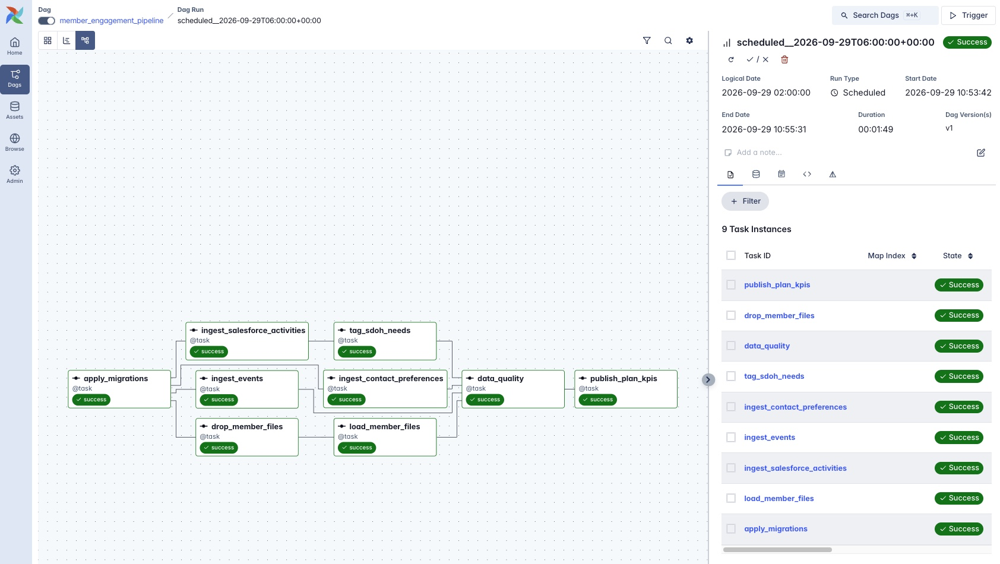

**The same run in the Grid view:** per-task start times and durations. The
whole pipeline takes under 2 minutes, with every task succeeding on its
first try.

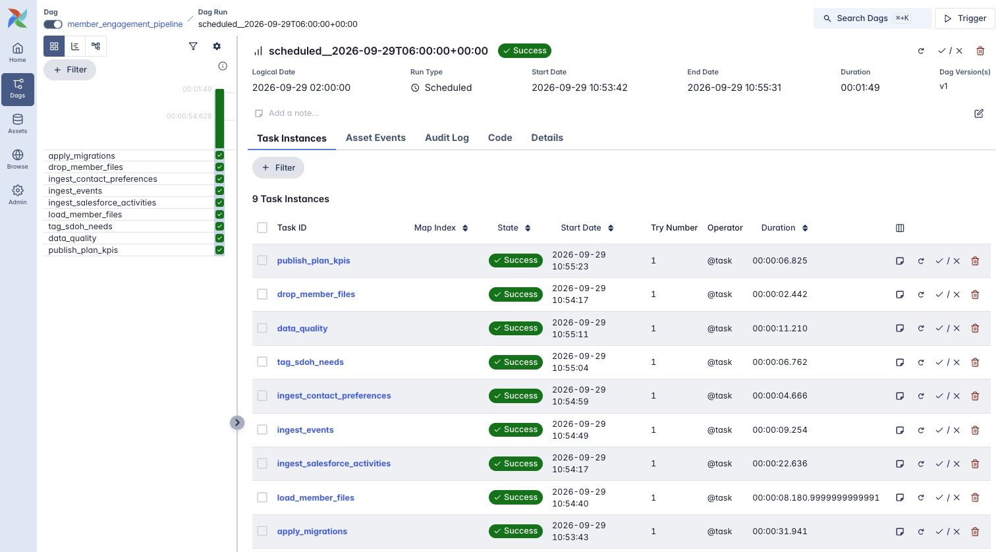

**Monthly program KPIs per health plan**: what each customer receives
(`analytics.v_plan_monthly_kpis`).

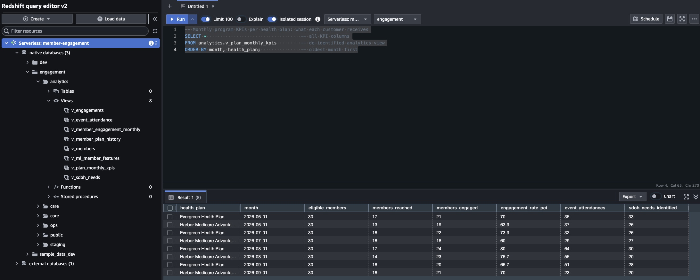

**Data quality results for one batch.** Integrity and completeness checks
pass. The three warnings are real findings: CHW activities for members
who aren't on any roster, opt-out requests in notes that never reached the
DNC sheet, and completed calls dated after an opt-out.

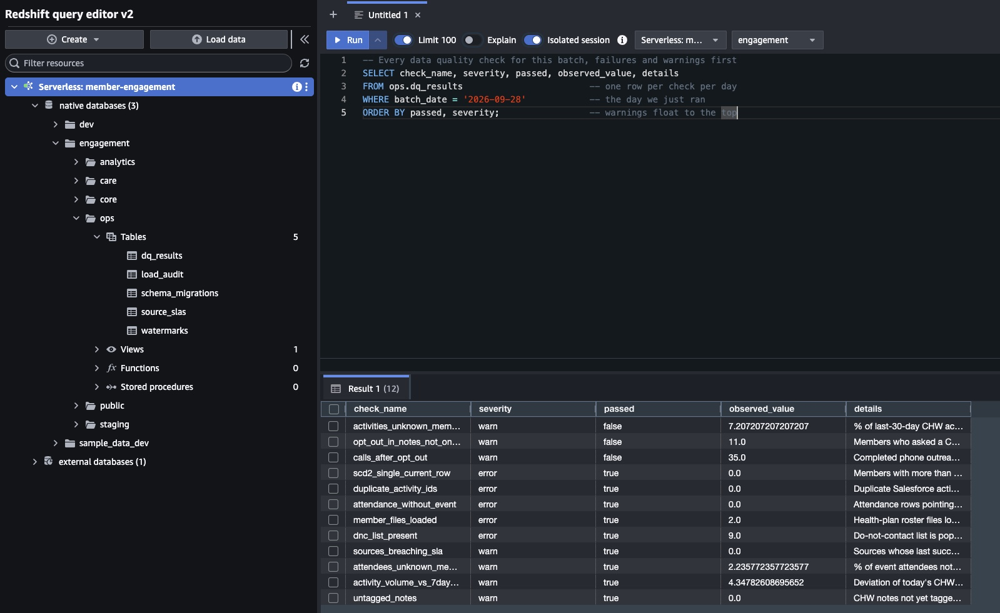

**Freshness SLAs per source** (`ops.v_sla_status`).

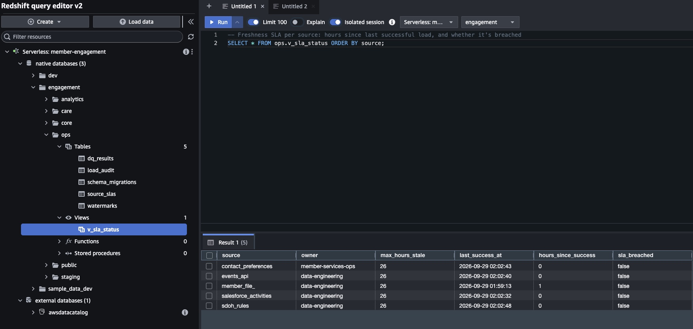

**Load audit: lineage and observability.** Every load records its
source, rows in, rows staged, rows rejected and status. The roster files
show 34 rows in per plan: 30 loaded, 2 duplicates collapsed and 2 rejected to S3.

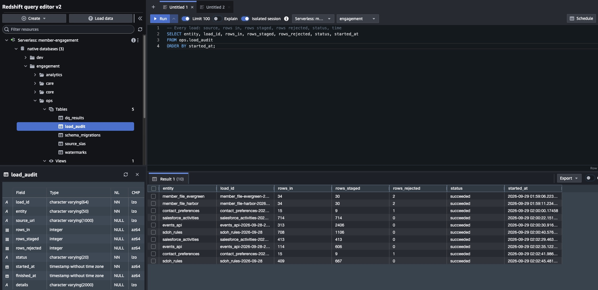

**Social needs identified in CHW notes, by county** (de-identified).

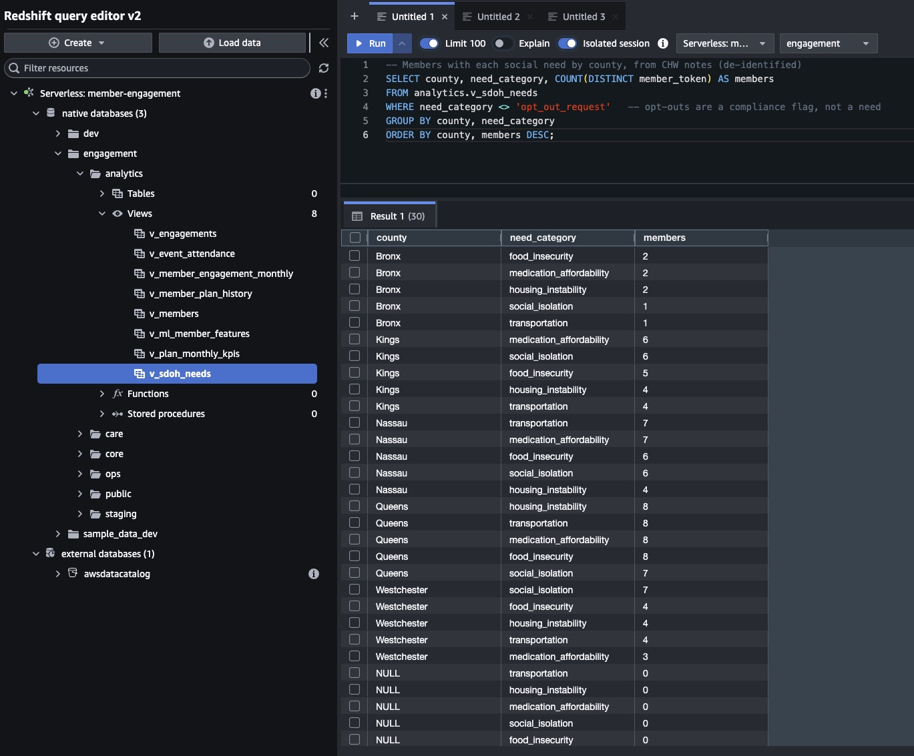

**Care team outreach queue**, prioritized by never-reached members and recent
social needs, with opted-out members excluded. The names and phone
numbers are synthetic (Faker).

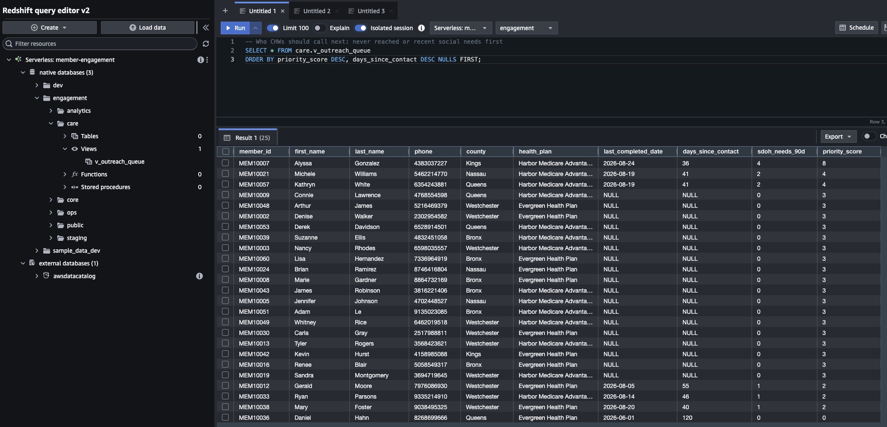

**Member feature table for Data Science** (`analytics.v_ml_member_features`).

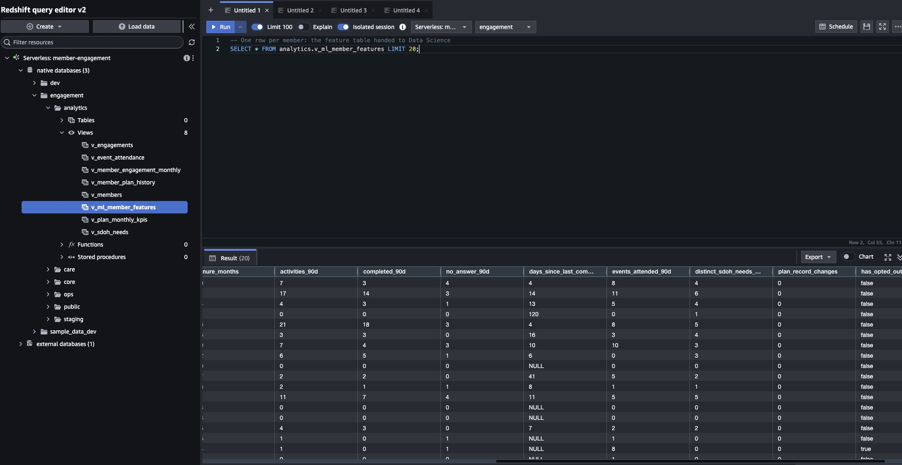

**Redshift Serverless scaling to zero.** RPU capacity jumps to 8 while
queries run and drops back to 0 in between, which is why this runs on
trial credits.

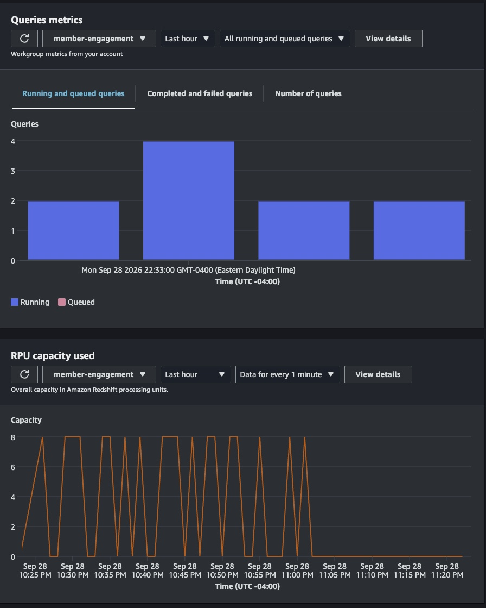

**Cost guardrails.** A $10 monthly budget (created by Terraform) and a
zero-spend budget, both healthy with $0.00 billed so far. The account's
credits cover the usage.

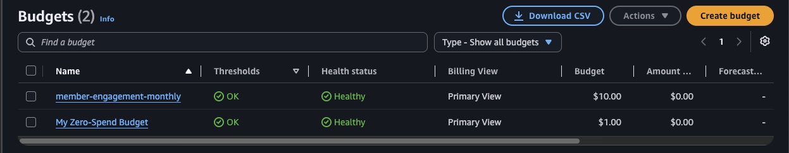

**The S3 data lake**: top-level zones, and one prefix per source under `raw/`.

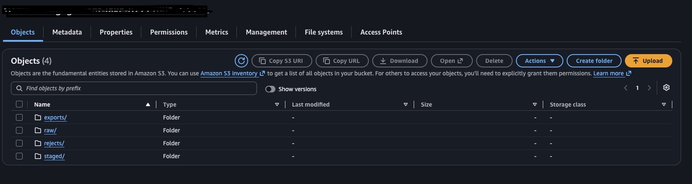

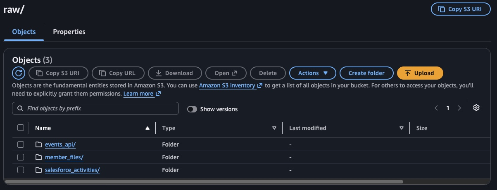

## Data sources

| Source | Shape | What makes it realistic |
|---|---|---|
| **Health-plan rosters** (`pipeline/sources/generate_member_files.py`) | Daily full-snapshot CSV per plan | Each plan uses its own column names, date formats and casing. Files include duplicates, a bad DOB and a blank member ID. Plan changes and terminations happen at month boundaries. |
| **Salesforce Task** (`mock_api` or a real org) | SOQL, `done`/`nextRecordsUrl` paging | Records change after creation (Open → Completed / No Answer), hand-typed member IDs, free-text CHW notes, ~3% of member IDs not on any roster |
| **Events platform** (`mock_api`) | REST, cursor paging, nested attendees | Upcoming, completed and cancelled events, check-ins recorded the day after, walk-ins not on a roster |
| **Do-not-contact Google Sheet** (`mock_api` or real Sheets) | Sheets API v4 `values.get` | Three date formats, free-text channel values, duplicate entries, blank rows, a mistyped member ID, trailing cells dropped |

The mock API returns the same response shapes as the real services. The
ingestion code switches to real Salesforce or Google Sheets when their
credentials are set in `.env` (a free Salesforce Developer Edition org
works, with a `Member_ID__c` custom field on Task).

## Design decisions worth talking about

**Redshift doesn't enforce keys, so idempotency lives in the load pattern.**
`PRIMARY KEY`/`UNIQUE` are planner hints only. Every load runs inside one
transaction: `DELETE` the staging rows for this `load_id`, `COPY` the
Parquet, `CALL` the merge procedure, write `ops.load_audit`, then `COMMIT`.
`TRUNCATE` would commit implicitly, so the staging reset is a `DELETE`. The
merge procedures use `MERGE` (Salesforce, events), SCD2
close-and-insert (rosters), or delete-insert on natural keys. A
`duplicate_activity_ids` check catches anything that slips through.

**SCD Type 2 member rosters.** Each roster is a full snapshot. A change in
`record_hash` closes the current version and opens a new one. Re-running a
date is a no-op. Loads must apply in date order, so the task sets
`depends_on_past=True` and the DAG sets `max_active_runs=1`.

**Watermarks advance with the data.** The Salesforce and events watermarks
are written in the same transaction as the merge they describe. A failed
load can't skip records, and a retry re-pulls from the last committed point.

**Parquet contract.** Parquet `COPY` maps columns by position. `pipeline/schemas.py` defines
explicit Arrow schemas (microsecond timestamps, `date32`, `int32`), and
`tests/test_staging_contract.py` parses the staging DDL to prove the two
never drift apart.

**The do-not-contact snapshot can't be silently emptied.**
`core.sp_merge_contact_preferences` raises an error on an empty snapshot,
so a broken or blank sheet read fails loudly instead of putting every
opted-out member back in the call queue. Channel parsing is conservative:
a blank or unrecognized channel counts as `all`.

**Social-needs (SDoH) tagging is versioned and re-runnable.**
`pipeline/enrich/sdoh_rules.py` tags CHW notes for food insecurity,
transportation, isolation, housing, medication cost, and opt-out requests.
`core.note_classifications` records `method` and `rule_version` for every
note, so a note is re-tagged when it's edited or the rules change. A second
classifier (e.g. an LLM) can later be added as a new `method` and compared
against the rule-based results on the same notes.

**Serialized Redshift writes.** Redshift uses serializable isolation, so
concurrent writers to the same table can abort each other (error 1023).
All Redshift-writing tasks share a 1-slot Airflow pool; API reads still run
in parallel.

## PHI / PII handling

- **Tokenized member key.** `member_token = HMAC-SHA256(PHI_HASH_KEY, member_id)`
  is stable enough to join and count on. It can't be reversed or recomputed
  without the key, unlike a plain `md5(member_id)`.
- **Three access tiers** (`V007__access_control.sql`):
  - `analyst_ro`: de-identified `analytics.*` only. No names, DOB, phone,
    member ID, full ZIP or notes.
  - `care_team_ro`: `care.v_outreach_queue` only (name, phone, county, priority).
  - `data_science_ro`: `core.*` for feature work, with **dynamic data
    masking** on notes, names, phone (last 4) and DOB (year only).
- **Storage:** S3 bucket with SSE, versioning, public access blocked, and a
  bucket policy denying non-TLS requests. Redshift's IAM role can read
  `staged/` only and never sees raw files.
- **Logs** carry counts only, never member rows or note text.
  `pipeline.phi.redact()` is there for free text that must leave the
  warehouse.

## Data quality & SLAs

`pipeline/quality/data_quality.py` runs after every load and writes each result to `ops.dq_results`.

| Kind | Checks |
|---|---|
| Integrity (error) | one current SCD2 row per member · no duplicate activity IDs · no attendance without an event |
| Completeness (error) | every plan's roster loaded for the date · DNC list populated |
| Freshness (warn) | any source past its SLA in `ops.v_sla_status` |
| Conformance (warn) | % of activities / attendees whose member isn't on a roster |
| Anomaly (warn) | today's CHW activity volume vs. the trailing 7-day average |
| Enrichment (warn) | CHW notes not yet tagged |
| Outreach compliance (warn) | opt-out requested in a note but missing from the DNC sheet · completed calls dated after an opt-out |

Error-level failures fail the run, so KPIs are never published on bad data.
The failure alert email includes each failed check and its observed value.
The mock data deliberately triggers some of the compliance warnings, so
expect to see them.

## Cron → Airflow

`legacy/` holds the "before": a nightly shell script plus staggered crontab
entries that *hope* the earlier jobs finished. The DAG replaces it:

| Legacy cron | DAG |
|---|---|
| A step fails → later steps silently don't run; the signal is a log file | Per-task state, retries, email alert after retries are exhausted |
| Timing coupling (`30 2 * * *` hopes the 2:00 job finished) | Explicit dependencies |
| Strictly sequential | Sources load in parallel where safe |
| "Today" is implicit; re-running a date means editing the script | Logical date `ds`, backfills, clear-and-rerun a single task |
| KPIs are sent even when the data behind them is broken | `publish_plan_kpis` runs only after `data_quality` passes |
| No record of what ran on what | Airflow history + `ops.load_audit` + `ops.dq_results` + `ops.v_sla_status` |

In production the move would be staged: run the DAG in shadow mode next to
cron, compare `ops.load_audit` row counts for a week, then disable the
crontab entries.

## Cost (free / trial AWS account)

- **S3, IAM, AWS Budgets:** effectively free at this data volume.
- **Redshift Serverless** is the only real cost. It bills per RPU-second
  while queries run and pauses when idle. New Redshift Serverless users
  have typically been offered a free-trial credit, and new AWS accounts get
  sign-up credits. Check the current terms for your account.
- **Guardrails in Terraform:** 8 RPU base capacity, a daily RPU-hour usage
  limit that *deactivates* the workgroup when exceeded, and a monthly
  budget alert at 50% actual / 100% forecasted.
- **When you're done:** run `terraform destroy`. The bucket has `force_destroy` set because all data is synthetic.

## Setup

**Prerequisites:** Python 3.11, Terraform ≥ 1.6, AWS CLI, an AWS account.

```bash
# 1. Infrastructure
cd infra/terraform
cp terraform.tfvars.example terraform.tfvars   # set your IP, a Redshift password, alert email
terraform init && terraform apply
terraform output

# 2. Credentials: IAM console -> user "member-engagement-pipeline" -> create access key
aws configure --profile member-engagement

# 3. Python env + config
cd ../..
python3.11 -m venv .venv && source .venv/bin/activate
pip install -r requirements.txt
cp .env.example .env    # paste terraform outputs, generate PHI_HASH_KEY

# 4. Mock Salesforce / events / Sheets APIs (separate terminal)
uvicorn mock_api.main:app --port 9000

# 5. Schema
python -m pipeline.migrate
```

**Run one day by hand**, which is also what the DAG does:

```bash
D=2026-09-28
python -m pipeline.sources.generate_member_files $D
python -m pipeline.ingest.member_files $D
python -m pipeline.ingest.salesforce_activities $D
python -m pipeline.ingest.events $D
python -m pipeline.ingest.contact_preferences $D
python -m pipeline.enrich.sdoh_rules $D
python -m pipeline.quality.data_quality $D
python -m pipeline.publish.plan_kpis $D
```

**Airflow** (separate venv; Airflow pins its own dependency set):

```bash
cd airflow
python3.11 -m venv .venv && source .venv/bin/activate
pip install -r requirements.txt
export AIRFLOW_HOME="$(pwd)/airflow_home" AIRFLOW__CORE__DAGS_FOLDER="$(pwd)/dags"
airflow db migrate
airflow pools set redshift 1 "Serialize Redshift writers"
airflow connections add smtp_default --conn-type smtp --conn-host smtp.gmail.com --conn-port 587 \
  --conn-login you@gmail.com --conn-password '<app password>' --conn-extra '{"disable_ssl": true}'
airflow standalone          # http://localhost:8080, unpause member_engagement_pipeline
```

## Tests

```bash
pytest -q tests                                   # 46 unit tests, no AWS needed (moto + FastAPI TestClient)
cd airflow && pytest -q tests                     # DAG integrity (needs the Airflow venv + env vars above)
```

The tests cover roster normalization for both plan layouts, SCD2 change
detection, Salesforce/events pagination and flattening, DNC sheet cleanup,
SDoH rules, the Parquet ↔ DDL contract, transaction shape and rollback for
loads, migration checksums, and KPI upserts. CI runs the unit tests, the
DAG tests, and `terraform validate` on every push.

**Verified on live AWS.** `terraform apply` built all 15 resources, and
migrations V001-V008 applied on Redshift Serverless, including the stored
procedures, `MERGE`, roles and dynamic data masking. A full pipeline day
then ran end to end. The first live run surfaced three things the local
tests couldn't:
- Redshift rejects multi-statement batches where a later statement depends
  on an earlier one, so `migrate.py` now splits files into single
  statements, respecting `$$` procedure bodies.
- A transient network drop timed out two loads, so the Redshift
  connection now retries with backoff.
- The KPI view counted months that only had upcoming scheduled events. This
  was fixed forward in migration `V008` instead of editing the applied V006.

## Roadmap

- **LLM utilities (next).** Add an LLM classifier for CHW notes as a second
  `method` next to the rule-based one, so the two can be compared on the
  same notes. Also an anomaly-explanation note in DQ failure alerts. Notes
  are PHI, so this path would use Amazon Bedrock under the AWS BAA.
- **Production hardening.** Secrets Manager instead of `.env`, a
  VPC-private Redshift workgroup with Airflow on MWAA or ECS, and AWS
  Transfer Family for health-plan SFTP drops.

## Layout

```
infra/terraform/     S3 lake, IAM (least privilege), Redshift Serverless, usage limit, budget
sql/redshift/        V001-V008 versioned migrations (schemas, tables, staging, ops/SLAs, procedures, views, RBAC)
pipeline/            config, s3_io, redshift, loaders (Parquet->COPY->MERGE), schemas, phi, migrate, watermarks, http
  sources/           health-plan roster file simulator
  ingest/            member_files, salesforce_activities, events, contact_preferences
  enrich/            sdoh_rules
  quality/           data_quality
  publish/           plan_kpis (Google Sheets + S3 export)
mock_api/            Salesforce / events platform / Google Sheets stand-ins (FastAPI)
airflow/             DAG, failure alerting, DAG tests
legacy/              the cron setup the DAG replaces
tests/               unit tests
```
