# Member Engagement Data Pipeline (AWS)

A production-style data platform for a **community health worker (CHW)
program** serving health-plan members. The program's customers are health
plans. Each plan sends a roster of its members, CHWs reach out to those
members and log the work in Salesforce, members attend community events, and
each plan gets monthly program KPIs back. On top of that, a **Neighborhood
Vulnerability Index** combines claims, health risk assessments, NYC
housing-violation data and NOAA weather alerts to flag which members need
a wellness check before extreme heat or cold.

Built on **S3 + IAM + Redshift Serverless**, with **pandas/SQL** pipelines,
**Airflow** orchestration (replacing a legacy cron job), ingestion from
**Salesforce, a REST API and Google Sheets**, and PHI safeguards throughout.
Everything is synthetic, and the infrastructure is sized for a free or
trial AWS account.

## Architecture

```
  Health plans (customers)        Salesforce            Events platform        Google Sheet
  roster CSVs, 2 layouts          CHW activity (Task)   REST, cursor-paged     do-not-contact list
  + daily claims extracts         + free-text notes     nested attendees       (hand-maintained)
          │                              │                      │                     │
  HRA survey vendor (JSONL)       NYC Open Data (HPD housing violations)   NOAA / NWS weather alerts
          │                              │  Socrata, public                     │  GeoJSON, public
          ▼                              ▼                      ▼                     ▼
  ┌─────────────────────────────── S3 data lake (SSE, TLS-only, versioned) ──────────────────┐
  │  raw/<source>/dt=YYYY-MM-DD/   every file and API page, as received (replayable)        │
  │  rejects/<source>/dt=.../      rows that failed validation, with a reason                │
  │  staged/<table>/load_id=.../   Parquet with an explicit Arrow schema                     │
  │  exports/plan_kpis/dt=.../     what was reported to each customer                        │
  └──────────────────────────────────────────┬───────────────────────────────────────────────┘
                                              │ COPY ... FORMAT AS PARQUET  (IAM role, staged/ only)
                                              ▼
  ┌─────────────────────────────── Redshift Serverless ──────────────────────────────────────┐
  │  staging.*   landing tables, keyed by load_id                                            │
  │  core.*      SCD2 rosters, engagements, events, DNC, SDoH needs, claims, HRAs (PHI)      │
  │              + public: housing violations, weather alerts, county FIPS                   │
  │  care.*      outreach queue + wellness-check queue (name + phone only)                   │
  │  analytics.* de-identified: plan KPIs, engagement, ML features, vulnerability index      │
  │  ops.*       migrations, load audit (lineage), DQ results, SLAs, API watermarks          │
  └──────────────────────────────────────────┬───────────────────────────────────────────────┘
                                              ▼
                        Google Sheets (per-plan KPI tabs) + CSV export
```

Orchestrated by Airflow (`airflow/dags/member_engagement_pipeline.py`):

```
apply_migrations ─┬─> drop_member_files ─> load_member_files (SCD2, depends_on_past) ─┬─> ingest_housing_violations ─┐
                  │                                                                    └──────────────────────────────┤
                  ├─> ingest_salesforce_activities ─> tag_sdoh_needs ─────────────────────────────────────────────────┤
                  ├─> ingest_events ──────────────────────────────────────────────────────────────────────────────────┤
                  ├─> ingest_contact_preferences ─────────────────────────────────────────────────────────────────────┼─> data_quality ─> publish_plan_kpis
                  ├─> drop_claims_files ─> load_claims ───────────────────────────────────────────────────────────────┤
                  ├─> drop_hra_file ─> load_hra ──────────────────────────────────────────────────────────────────────┤
                  └─> ingest_weather_alerts ──────────────────────────────────────────────────────────────────────────┘
```

Every Redshift-writing task runs in the 1-slot `redshift` pool. The
vulnerability index and the wellness-check queue are views, so they are
always current with whatever has loaded; `data_quality` asserts on them
before KPIs go out.

## How this maps to the role

Mapped against the [Healthcare Data Engineer posting](https://apply.workable.com/wider-circle/j/6E2BEB697A/):

| Posting asks for | Where it is here |
|---|---|
| ETL/ELT with Python (pandas) + SQL | `pipeline/ingest/*`: pandas normalization → Parquet → `COPY` → stored-procedure merge |
| Ingest from S3, APIs, Salesforce, internal systems | Roster + claims CSVs and HRA JSONL on S3; Salesforce Task via SOQL; events REST API; Google Sheet; public NYC Open Data and NWS APIs |
| Performant Redshift SQL: DDL, DML, stored procedures | `sql/redshift/V002`–`V013`: dist/sort keys, `MERGE`, SCD2, latest-version claim merges, snapshot replaces |
| Manage schemas, views, permissions, table evolution safely | Checksummed migration runner (`pipeline/migrate.py`), fix-forward migrations, RBAC roles, dynamic data masking |
| Debug production data issues | `ops.load_audit` (every load's source, rows in/staged/rejected, failures), raw payloads kept in S3 for replay |
| Data quality, freshness, lineage, observability | 25 checks → `ops.dq_results`; per-source SLAs → `ops.v_sla_status`; `source_file`/`source_uri` lineage |
| PHI/PII safeguards | HMAC member tokens, de-identified analytics (enforced by a DQ check on the column catalog), masking, TLS-only encrypted bucket, least-privilege IAM, no PHI in logs |
| Migrate cron → orchestration | `legacy/crontab` + `legacy/run_nightly.sh` (before) → the DAG (after); see [Cron → Airflow](#cron--airflow) |
| Idempotent, retry-safe jobs | Every load is one Redshift transaction; natural-key merges; watermarks advance in the same transaction |
| Clean, modeled datasets for Analytics / DS | Plan KPIs, member-month engagement, ML feature table, `analytics.v_member_vulnerability` |
| BI, reporting, Google Sheets integrations | `pipeline/publish/plan_kpis.py`: per-plan tabs, idempotent month upsert, S3 archive |
| Healthcare data: claims, eligibility, HRAs | SCD2 eligibility rosters; claims with replacement/void versioning; HRA surveys |
| Complex data integration | Vulnerability index joins claims, HRAs, CHW notes, ZIP-level housing data and county-level weather alerts |
| AWS S3, IAM, Redshift | `infra/terraform/` |
| Git, CI-friendly development | Feature branches, tagged releases, `.github/workflows/ci.yml` (unit tests, DAG tests, `terraform validate`) |

## Screenshots

Deployed with Terraform to a real AWS account and run end to end against
Redshift Serverless. (Member names and phone numbers anywhere in this
project are synthetic Faker data; these queries leave them out anyway.)

### Orchestration

**The Airflow DAG: one full daily run, all 15 tasks green on the first try,
in about 90 seconds.** Migrations run first; the roster load, the
Salesforce/events/Sheets pulls, the claims and HRA drops and the public
housing and weather pulls fan out from there; social-needs tagging waits
for Salesforce; housing waits for member ZIPs; data quality gates the KPI
publish.

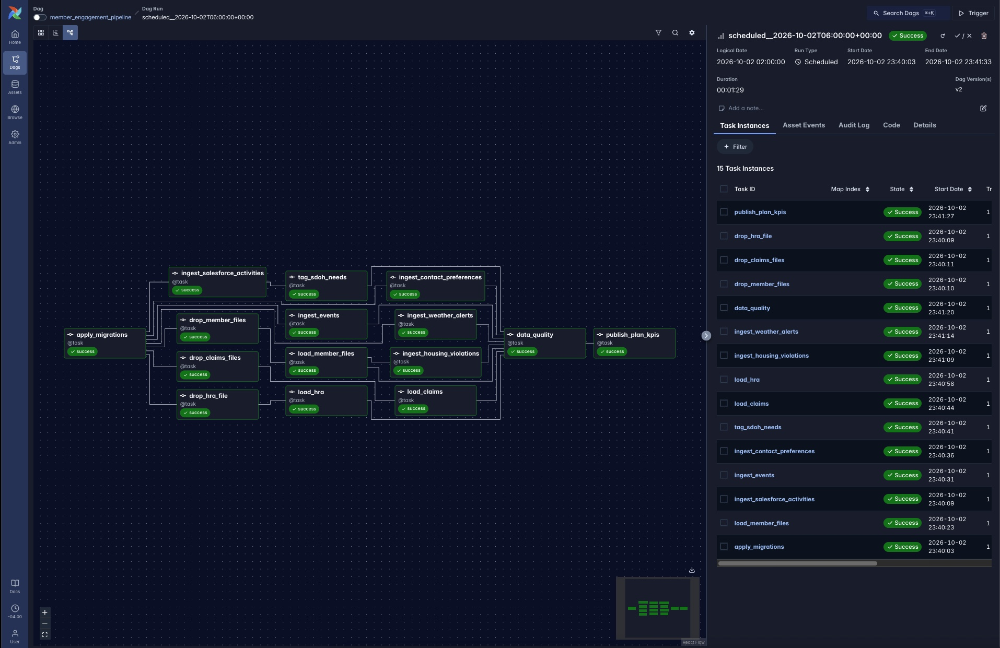

### Neighborhood Vulnerability Index

**The wellness-check call list during a heat scenario.** Members in
counties under an active Heat Advisory or Extreme Heat Warning, ranked by
vulnerability, each with the reasons to call. Phone opt-outs and members
a CHW already reached since the alert began are excluded.

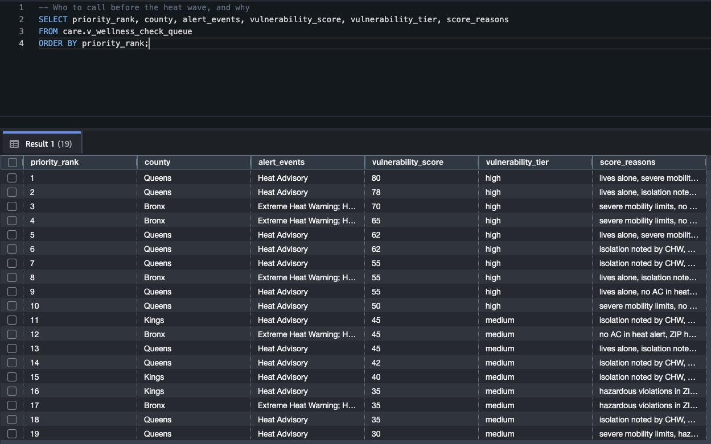

**Explainable scoring, de-identified.** Each factor's points per member
(shortened member token, 3-digit ZIP, age band). Nassau and Westchester
have no active alert in this scenario, so their members score on their
baseline factors only.

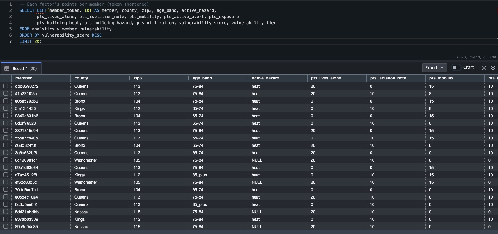

**Risk tiers by county and alert status.**

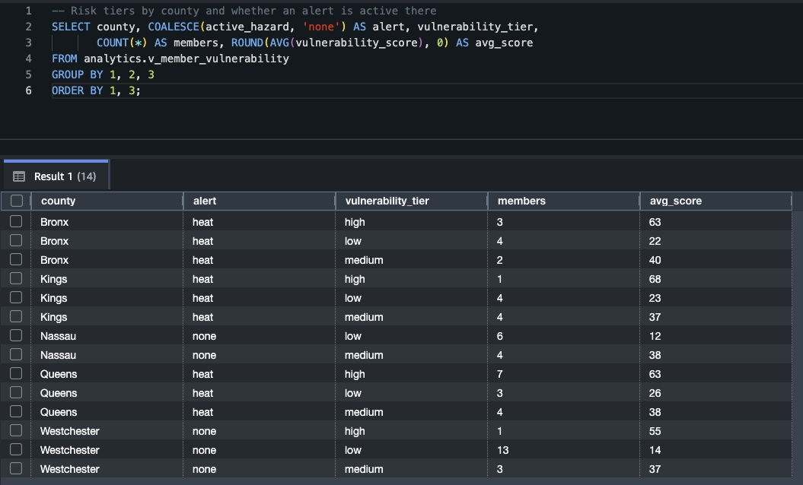

### The four new sources

**Claims, latest version per claim.** Replacements and voids are applied,
so voided claims carry negative paid amounts and never double count.

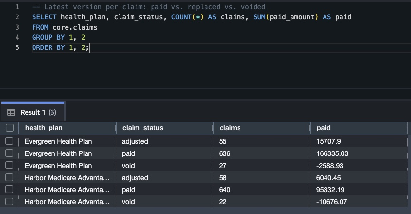

**HRA survey answers after normalization** (lives alone, no AC, no
reliable heat, by mobility level).

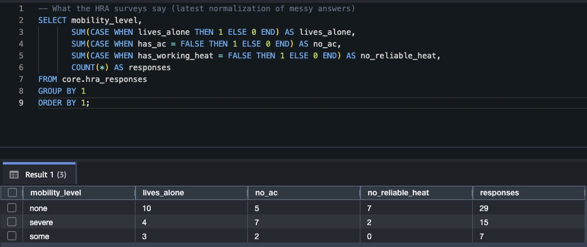

**NYC ZIPs with the most open housing violations** (public HPD data):
total open, class C (immediately hazardous) and heat/hot water.

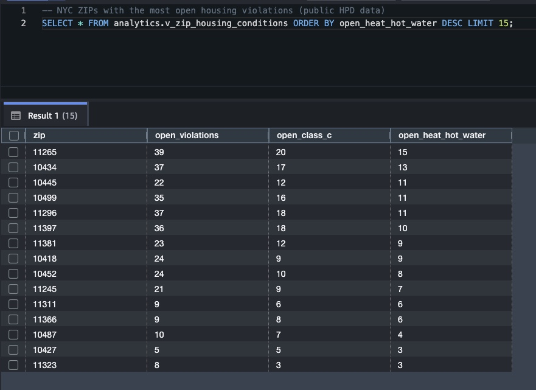

**Heat alerts in effect, by county** (NOAA/NWS). Alerts issued on
consecutive days overlap, and each issuance has its own NWS id, which
is how the merge keeps alert history.

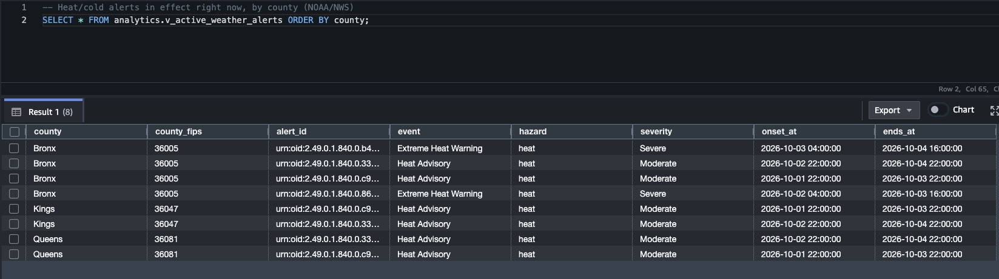

### Member engagement

**Monthly program KPIs per health plan**: what each customer receives
(`analytics.v_plan_monthly_kpis`).


**Social needs identified in CHW notes, by county** (de-identified).


**Care team outreach queue**, prioritized by never-reached members and recent
social needs, with opted-out members excluded.


**Member feature table for Data Science** (`analytics.v_ml_member_features`).


### Reliability and observability

**All 25 data quality checks for a full day.** Every error-level check
passes; the two warnings are real compliance findings the mock data
triggers on purpose (opt-outs mentioned in CHW notes but missing from the
DNC sheet, and calls dated after an opt-out).

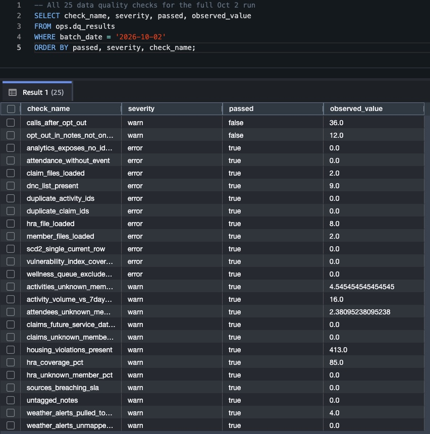

**Freshness SLAs for all 9 sources** (`ops.v_sla_status`).

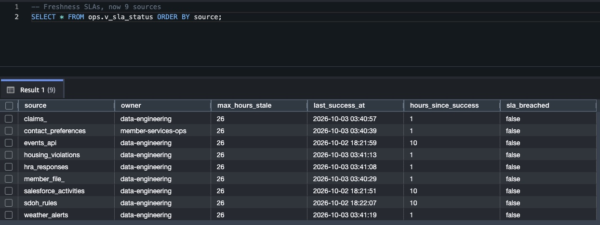

**Load audit: lineage per load.** Every load records its source, rows in,
rows staged, rows rejected and status. The roster files show 34 rows in
per plan: 30 loaded, 2 duplicates collapsed and 2 rejected to S3.


**Safe schema evolution.** All 13 migrations applied in order, each with a
checksum, including the V008 fix-forward and the V009-V013 vulnerability
index work.

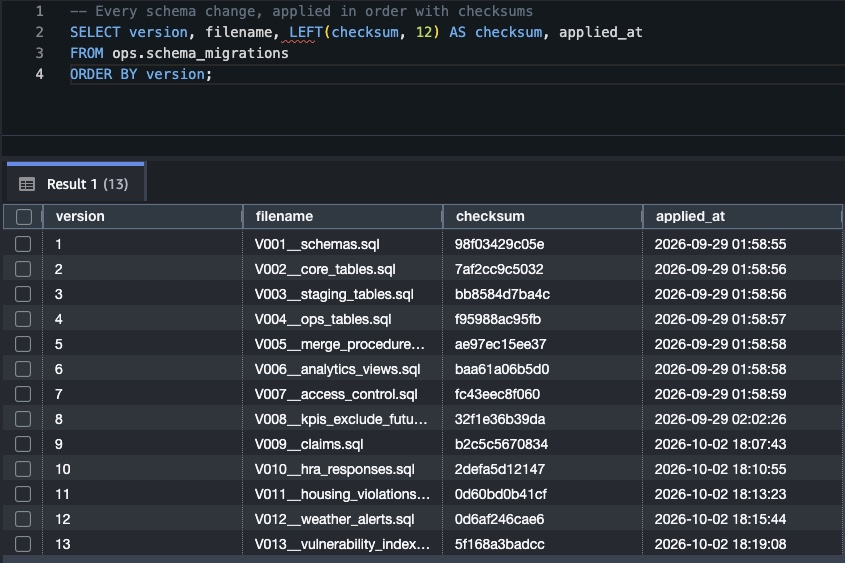

### Infrastructure and cost

**Redshift Serverless scaling to zero.** RPU capacity jumps to 8 while
queries run and drops back to 0 in between, which is why this runs on
trial credits.


**Cost guardrails.** A $10 monthly budget (created by Terraform) and a
zero-spend budget, both healthy with $0.00 billed so far. The account's
credits cover the usage.


**The S3 data lake**: top-level zones, one raw folder per source (7), and
a rejects folder per source for rows that failed validation.


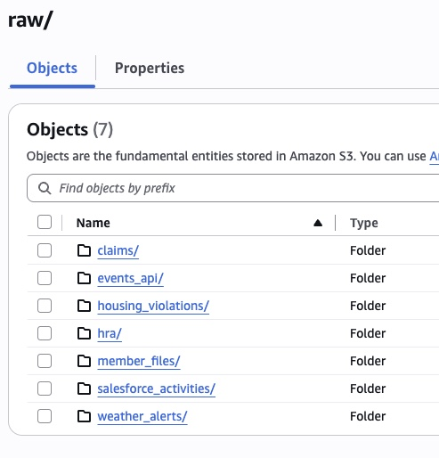

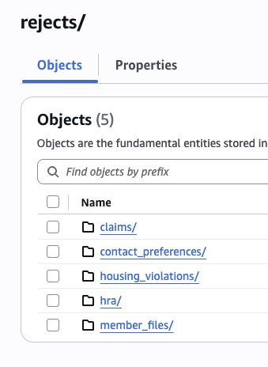

### Engineering workflow

**The feature built as 7 reviewable commits and merged through a pull
request.**

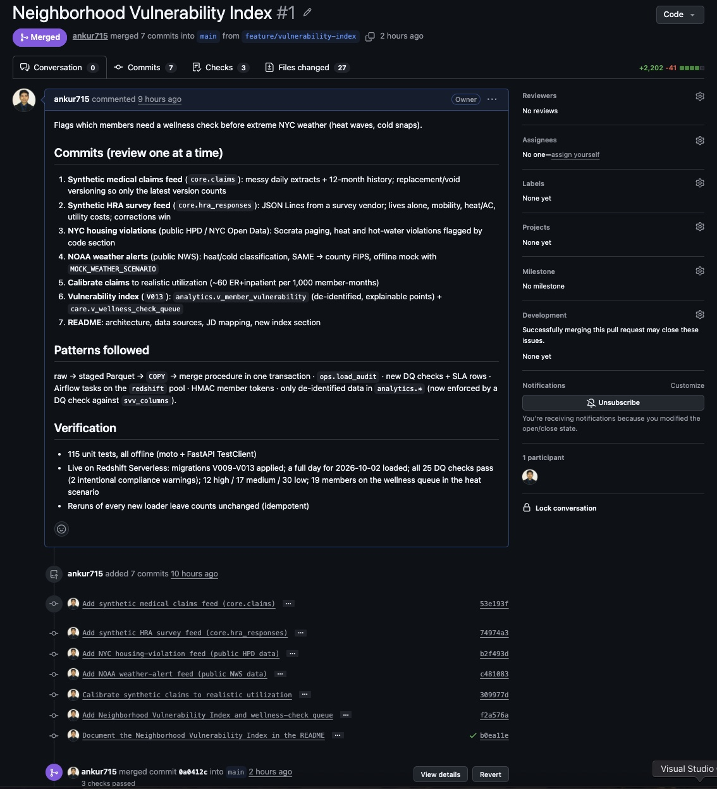

**CI on the pull request:** unit tests, DAG integrity tests and
`terraform validate`, all green.

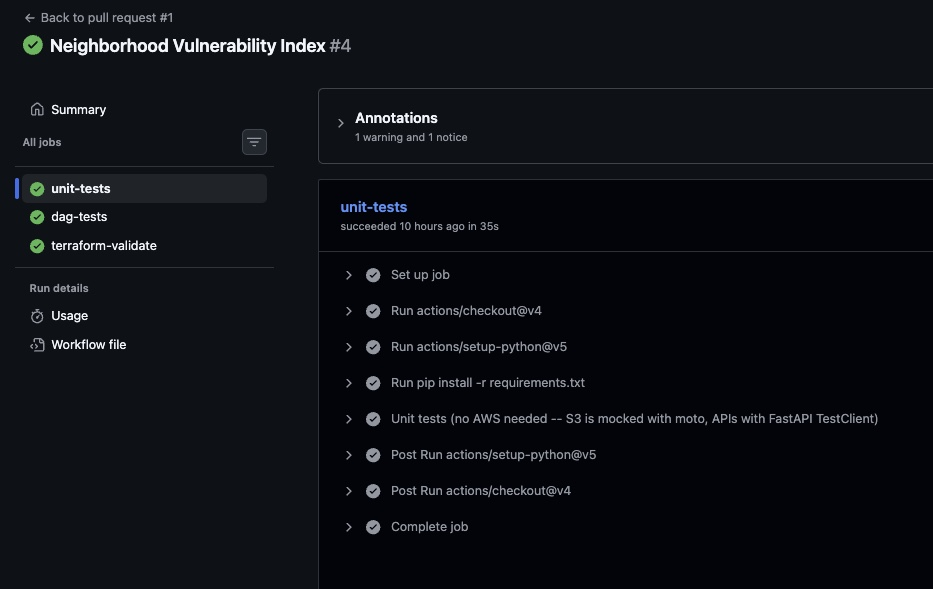

## Data sources

| Source | Shape | What makes it realistic |
|---|---|---|
| **Health-plan rosters** (`pipeline/sources/generate_member_files.py`) | Daily full-snapshot CSV per plan | Each plan uses its own column names, date formats and casing. Files include duplicates, a bad DOB and a blank member ID. Plan changes and terminations happen at month boundaries. |
| **Salesforce Task** (`mock_api` or a real org) | SOQL, `done`/`nextRecordsUrl` paging | Records change after creation (Open → Completed / No Answer), hand-typed member IDs, free-text CHW notes, ~3% of member IDs not on any roster |
| **Events platform** (`mock_api`) | REST, cursor paging, nested attendees | Upcoming, completed and cancelled events, check-ins recorded the day after, walk-ins not on a roster |
| **Do-not-contact Google Sheet** (`mock_api` or real Sheets) | Sheets API v4 `values.get` | Three date formats, free-text channel values, duplicate entries, blank rows, a mistyped member ID, trailing cells dropped |
| **Medical claims** (`pipeline/sources/generate_claims.py`) | Daily CSV per plan + 12-month history at onboarding | Mixed date formats, `$1,234.50` / `(12.50)` amounts, revenue codes missing leading zeros, ICD-10 without dots, duplicates, and **restatements** (replacement `7` / void `8`) of earlier claims. Calibrated to MA-like utilization (~60 ER+inpatient events per 1,000 member-months). |
| **HRA surveys** (`pipeline/sources/generate_hra.py`) | Daily JSON Lines from a survey vendor | Yes/no as `"Yes"`/`"Y"`/`true`/`1`, free-text mobility ("Uses walker"), "Sometimes" heat, "fan only" cooling, partial surveys, corrected resends under the same `response_id` |
| **NYC housing violations** (NYC Open Data, `wvxf-dwi5`) | Socrata SoQL, `$limit`/`$offset` paging | Real field names and wording; ZIP+4 and blank ZIPs, lowercase classes, both "ADM CODE" and "ADMIN. CODE:" phrasings |
| **NOAA weather alerts** (`api.weather.gov/alerts/active`) | GeoJSON, public | SAME county codes, marine zones to ignore, local-time offsets, `ends` often null (fall back to `expires`) |

The mock API returns the same response shapes as the real services. The
ingestion code switches to real Salesforce or Google Sheets when their
credentials are set in `.env` (a free Salesforce Developer Edition org
works, with a `Member_ID__c` custom field on Task). The public sources
switch to the live APIs with `NYC_OPEN_DATA_URL=https://data.cityofnewyork.us`
and `NWS_API_URL=https://api.weather.gov`; their field names were checked
against the live endpoints. NY rarely has an active heat or cold alert, so
the mock's `MOCK_WEATHER_SCENARIO` (`heat` / `cold` / `none` / `auto` by
season) makes demos and tests reproducible.

## Neighborhood Vulnerability Index

**Question:** before a heat wave or cold snap, which members should a CHW
call first?

Every active member gets a transparent, explainable score (points, capped
at 100), not a black-box model, so a care coordinator can see *why*
someone ranks high and the weights are easy to discuss and tune.

| Signal group | Factor | Points | Source |
|---|---|---|---|
| Isolation | Lives alone | 20 | HRA |
| | Social isolation tagged in a CHW note (last 180 days) | 10 | SDoH tags |
| | Mobility limitation: severe / some | 15 / 8 | HRA |
| Weather | Active heat or cold alert in the member's county | 10 | NWS |
| | **No AC during a heat alert, or no working heat during a cold one** | 20 | HRA × NWS |
| | Trouble paying utility bills | 5 | HRA |
| Building | ZIP in the top quartile for open heat/hot-water violations | 10 | NYC HPD |
| | Any open class C (immediately hazardous) violation in the ZIP | 5 | NYC HPD |
| Utilization | ER + inpatient per 1,000 member-months, last 12 months: ≥250 / ≥100 / any | 20 / 12 / 5 | Claims (voids excluded) |

Tiers: **high ≥ 50**, **medium ≥ 30**, low otherwise.

**Outputs**
- `analytics.v_member_vulnerability`: de-identified (member token, 3-digit
  ZIP, age band), with every input, each factor's points, the score, the
  tier, and a plain-language `score_reasons` string. For analysts and Data
  Science.
- `care.v_wellness_check_queue`: the call list. Members in a county under
  an active heat/cold alert, medium or high tier, **not opted out of phone
  contact**, and not already reached by a CHW since the alert began, ranked
  by score, with name and phone for the care team only.

Example queue rows from a live run with a heat scenario:

```
rank  county  score  tier  reasons
1     Queens  80     high  lives alone, severe mobility limits, no AC in heat alert,
                           ZIP has many heat/hot-water violations, hazardous violations in ZIP
2     Queens  78     high  lives alone, isolation noted by CHW, some mobility limits,
                           no AC in heat alert, hazardous violations in ZIP, ER/inpatient use 83.3/1k MM
3     Bronx   70     high  severe mobility limits, no AC in heat alert, hazardous violations in ZIP,
                           ER/inpatient use 333.3/1k MM
```

**How the joins work**
- Claims → member by `member_id`; ER = POS 23 / revenue 045x / CPT
  99281–99285, inpatient = POS 21 / revenue 0100–0219; distinct service
  dates, so a multi-line claim isn't double counted; the denominator is
  member-months enrolled in the window.
- HRA → member by `member_id`, latest response per member (corrections
  win).
- Housing → member by **ZIP** (NYC HPD only covers the five boroughs, so
  Nassau and Westchester members show `building_data_available = false`
  rather than a misleading zero).
- Weather → member by **county FIPS** (`core.county_fips`), since NWS
  alerts are issued per county.

**Guarantees enforced by data quality (error level):** every active member
is scored exactly once; nobody on the wellness queue has opted out of phone
contact; and no `analytics.*` view exposes a direct identifier (checked
against Redshift's `svv_columns`).

**Limitations.** The weights are a reasonable starting point, not a
validated model: the next step would be to calibrate them against outcomes
(heat-related ER visits, e.g. ICD-10 T67) once there's history. Synthetic
ZIPs don't match real NYC ZIPs, so live HPD data needs real member ZIPs.
In production, weather alerts would be pulled every 1–2 hours rather than
with the daily batch.

## Design decisions worth talking about

**Redshift doesn't enforce keys, so idempotency lives in the load pattern.**
`PRIMARY KEY`/`UNIQUE` are planner hints only. Every load runs inside one
transaction: `DELETE` the staging rows for this `load_id`, `COPY` the
Parquet, `CALL` the merge procedure, write `ops.load_audit`, then `COMMIT`.
`TRUNCATE` would commit implicitly, so the staging reset is a `DELETE`. The
merge procedures use `MERGE` (Salesforce, events), SCD2
close-and-insert (rosters), or delete-insert on natural keys. A
`duplicate_activity_ids` check catches anything that slips through.

**SCD Type 2 member rosters.** Each roster is a full snapshot. A change in
`record_hash` closes the current version and opens a new one. Re-running a
date is a no-op. Loads must apply in date order, so the task sets
`depends_on_past=True` and the DAG sets `max_active_runs=1`.

**Watermarks advance with the data.** The Salesforce and events watermarks
are written in the same transaction as the merge they describe. A failed
load can't skip records, and a retry re-pulls from the last committed point.

**Parquet contract.** Parquet `COPY` maps columns by position. `pipeline/schemas.py` defines
explicit Arrow schemas (microsecond timestamps, `date32`, `int32`), and
`tests/test_staging_contract.py` parses the staging DDL to prove the two
never drift apart.

**The do-not-contact snapshot can't be silently emptied.**
`core.sp_merge_contact_preferences` raises an error on an empty snapshot,
so a broken or blank sheet read fails loudly instead of putting every
opted-out member back in the call queue. Channel parsing is conservative:
a blank or unrecognized channel counts as `all`.

**Social-needs (SDoH) tagging is versioned and re-runnable.**
`pipeline/enrich/sdoh_rules.py` tags CHW notes for food insecurity,
transportation, isolation, housing, medication cost, and opt-out requests.
`core.note_classifications` records `method` and `rule_version` for every
note, so a note is re-tagged when it's edited or the rules change. A second
classifier (e.g. an LLM) can later be added as a new `method` and compared
against the rule-based results on the same notes.

**Claims keep only the latest version.** Plans restate claims: a
replacement (frequency code 7) supersedes the original and a void (8)
cancels it. `core.sp_merge_claims` ranks versions (void > replacement >
original, then received date) and won't let an older file roll a claim
back. Summing every version would double-count utilization.

**Public data: snapshot vs. history.** Open housing violations are a
snapshot (replaced each run, so closed ones drop out). NWS only returns
alerts active *now*, so merging on the alert id is what builds history.

**Serialized Redshift writes.** Redshift uses serializable isolation, so
concurrent writers to the same table can abort each other (error 1023).
All Redshift-writing tasks share a 1-slot Airflow pool; API reads still run
in parallel.

## PHI / PII handling

- **Tokenized member key.** `member_token = HMAC-SHA256(PHI_HASH_KEY, member_id)`
  is stable enough to join and count on. It can't be reversed or recomputed
  without the key, unlike a plain `md5(member_id)`.
- **Three access tiers** (`V007__access_control.sql`):
  - `analyst_ro`: de-identified `analytics.*` only. No names, DOB, phone,
    member ID, full ZIP or notes.
  - `care_team_ro`: `care.v_outreach_queue` only (name, phone, county, priority).
  - `data_science_ro`: `core.*` for feature work, with **dynamic data
    masking** on notes, names, phone (last 4) and DOB (year only).
- **Storage:** S3 bucket with SSE, versioning, public access blocked, and a
  bucket policy denying non-TLS requests. Redshift's IAM role can read
  `staged/` only and never sees raw files.
- **Logs** carry counts only, never member rows or note text.
  `pipeline.phi.redact()` is there for free text that must leave the
  warehouse.

## Data quality & SLAs

`pipeline/quality/data_quality.py` runs 25 checks after every load and writes each result to `ops.dq_results`.

| Kind | Checks |
|---|---|
| Integrity (error) | one current SCD2 row per member · no duplicate activity IDs · no attendance without an event |
| Completeness (error) | every plan's roster loaded for the date · DNC list populated |
| Freshness (warn) | any source past its SLA in `ops.v_sla_status` |
| Conformance (warn) | % of activities / attendees whose member isn't on a roster |
| Anomaly (warn) | today's CHW activity volume vs. the trailing 7-day average |
| Enrichment (warn) | CHW notes not yet tagged |
| Outreach compliance (warn) | opt-out requested in a note but missing from the DNC sheet · completed calls dated after an opt-out |
| Claims | files loaded for every plan (error) · one current version per claim (error) · unknown members · future service dates |
| HRA | vendor file loaded (error) · unknown members · ≥50% of members surveyed in 12 months |
| Public data (warn) | housing violations present · weather pulled today · alert counties all mapped to FIPS |
| Vulnerability index (error) | every active member scored once · no phone opt-outs on the wellness queue · no identifiers in `analytics.*` |

Error-level failures fail the run, so KPIs are never published on bad data.
The failure alert email includes each failed check and its observed value.
The mock data deliberately triggers some of the compliance warnings, so
expect to see them.

## Cron → Airflow

`legacy/` holds the "before": a nightly shell script plus staggered crontab
entries that *hope* the earlier jobs finished. The DAG replaces it:

| Legacy cron | DAG |
|---|---|
| A step fails → later steps silently don't run; the signal is a log file | Per-task state, retries, email alert after retries are exhausted |
| Timing coupling (`30 2 * * *` hopes the 2:00 job finished) | Explicit dependencies |
| Strictly sequential | Sources load in parallel where safe |
| "Today" is implicit; re-running a date means editing the script | Logical date `ds`, backfills, clear-and-rerun a single task |
| KPIs are sent even when the data behind them is broken | `publish_plan_kpis` runs only after `data_quality` passes |
| No record of what ran on what | Airflow history + `ops.load_audit` + `ops.dq_results` + `ops.v_sla_status` |

In production the move would be staged: run the DAG in shadow mode next to
cron, compare `ops.load_audit` row counts for a week, then disable the
crontab entries.

## Cost (free / trial AWS account)

- **S3, IAM, AWS Budgets:** effectively free at this data volume.
- **Redshift Serverless** is the only real cost. It bills per RPU-second
  while queries run and pauses when idle. New Redshift Serverless users
  have typically been offered a free-trial credit, and new AWS accounts get
  sign-up credits. Check the current terms for your account.
- **Guardrails in Terraform:** 8 RPU base capacity, a daily RPU-hour usage
  limit that *deactivates* the workgroup when exceeded, and a monthly
  budget alert at 50% actual / 100% forecasted.
- **When you're done:** run `terraform destroy`. The bucket has `force_destroy` set because all data is synthetic.

## Setup

**Prerequisites:** Python 3.11, Terraform ≥ 1.6, AWS CLI, an AWS account.

```bash
# 1. Infrastructure
cd infra/terraform
cp terraform.tfvars.example terraform.tfvars   # set your IP, a Redshift password, alert email
terraform init && terraform apply
terraform output

# 2. Credentials: IAM console -> user "member-engagement-pipeline" -> create access key
aws configure --profile member-engagement

# 3. Python env + config
cd ../..
python3.11 -m venv .venv && source .venv/bin/activate
pip install -r requirements.txt
cp .env.example .env    # paste terraform outputs, generate PHI_HASH_KEY

# 4. Mock Salesforce / events / Sheets / NYC Open Data / NWS APIs (separate terminal)
MOCK_WEATHER_SCENARIO=heat uvicorn mock_api.main:app --port 9000

# 5. Schema
python -m pipeline.migrate
```

**Run one day by hand**, which is also what the DAG does:

```bash
D=2026-09-28
python -m pipeline.sources.generate_member_files $D
python -m pipeline.ingest.member_files $D
python -m pipeline.ingest.salesforce_activities $D
python -m pipeline.ingest.events $D
python -m pipeline.ingest.contact_preferences $D
python -m pipeline.enrich.sdoh_rules $D
python -m pipeline.sources.generate_claims $D --history   # --history only the first time
python -m pipeline.ingest.claims $D
python -m pipeline.sources.generate_hra $D --history
python -m pipeline.ingest.hra $D
python -m pipeline.ingest.housing_violations $D
python -m pipeline.ingest.weather_alerts $D
python -m pipeline.quality.data_quality $D
python -m pipeline.publish.plan_kpis $D
```

**Airflow** (separate venv; Airflow pins its own dependency set):

```bash
cd airflow
python3.11 -m venv .venv && source .venv/bin/activate
pip install -r requirements.txt
export AIRFLOW_HOME="$(pwd)/airflow_home" AIRFLOW__CORE__DAGS_FOLDER="$(pwd)/dags"
airflow db migrate
airflow pools set redshift 1 "Serialize Redshift writers"
airflow connections add smtp_default --conn-type smtp --conn-host smtp.gmail.com --conn-port 587 \
  --conn-login you@gmail.com --conn-password '<app password>' --conn-extra '{"disable_ssl": true}'
airflow standalone          # http://localhost:8080, unpause member_engagement_pipeline
```

## Tests

```bash
pytest -q tests                                   # 115 unit tests, no AWS or internet needed (moto + FastAPI TestClient)
cd airflow && pytest -q tests                     # DAG integrity (needs the Airflow venv + env vars above)
```

The tests cover roster normalization for both plan layouts, SCD2 change
detection, Salesforce/events pagination and flattening, DNC sheet cleanup,
SDoH rules, claims cleanup and restatement rates, HRA answer
normalization, Socrata paging and HPD cleanup, NWS alert parsing and
county mapping, the Parquet ↔ DDL contract, transaction shape and rollback
for loads, migration checksums, and KPI upserts. CI runs the unit tests, the
DAG tests, and `terraform validate` on every push.

**Verified on live AWS.** `terraform apply` built all 15 resources, and
migrations V001-V013 applied on Redshift Serverless, including the stored
procedures, `MERGE`, roles and dynamic data masking. A full pipeline day
then ran end to end. The first live run surfaced three things the local
tests couldn't:
- Redshift rejects multi-statement batches where a later statement depends
  on an earlier one, so `migrate.py` now splits files into single
  statements, respecting `$$` procedure bodies.
- A transient network drop timed out two loads, so the Redshift
  connection now retries with backoff.
- The KPI view counted months that only had upcoming scheduled events. This
  was fixed forward in migration `V008` instead of editing the applied V006.
- The first synthetic claims feed was far too dense (2,000+ ER/inpatient
  events per 1,000 member-months), which made utilization scores
  meaningless. It was recalibrated to MA-like levels (live: mean ~60) in its
  own commit before the index was built on it.

## Roadmap

- **LLM utilities (next).** Add an LLM classifier for CHW notes as a second
  `method` next to the rule-based one, so the two can be compared on the
  same notes. Also an anomaly-explanation note in DQ failure alerts. Notes
  are PHI, so this path would use Amazon Bedrock under the AWS BAA.
- **Production hardening.** Secrets Manager instead of `.env`, a
  VPC-private Redshift workgroup with Airflow on MWAA or ECS, and AWS
  Transfer Family for health-plan SFTP drops.

## Layout

```
infra/terraform/     S3 lake, IAM (least privilege), Redshift Serverless, usage limit, budget
sql/redshift/        V001-V013 versioned migrations (schemas, tables, staging, ops/SLAs, procedures, views, RBAC,
                     claims, HRA, housing violations, weather alerts, vulnerability index)
pipeline/            config, s3_io, redshift, loaders (Parquet->COPY->MERGE), schemas, phi, migrate, watermarks, http
  sources/           simulators: health-plan rosters, claims extracts, HRA survey exports
  ingest/            member_files, salesforce_activities, events, contact_preferences,
                     claims, hra, housing_violations, weather_alerts
  enrich/            sdoh_rules
  quality/           data_quality
  publish/           plan_kpis (Google Sheets + S3 export)
mock_api/            Salesforce / events / Google Sheets / NYC Open Data / NWS stand-ins (FastAPI)
airflow/             DAG, failure alerting, DAG tests
legacy/              the cron setup the DAG replaces
tests/               unit tests
```
